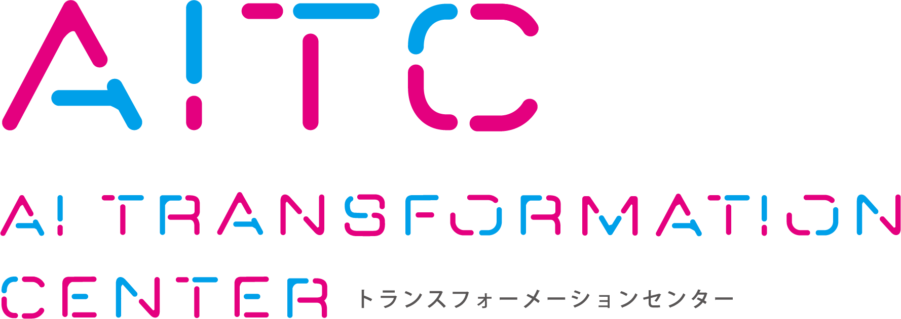

# Preference Descriptions for Dynamic Personalization of Large Language Models


## Author
<p>
  
</p>

Naofumi Osawa  
AI Transformation Center (AITC), DENTSU SOKEN INC., Japan


## Abstract
Personalization of large language models (LLMs) has recently gained attention
as a key approach to enhancing their usability and adaptability to individual
users. However, when personalization relies on interaction histories,
inconsistencies often arise between past and current user preferences, causing
models to fail to properly adapt to a user’s most recent intent.

We propose a simple preference representation that encodes each preference as
an intensity and polarity vector and aggregates past and recent preferences
arithmetically to form a contradiction-free, up-to-date personalized prompt.
This enables LLMs to dynamically update user preferences at test time by
linearly combining past and current preferences to produce a consistent
personalized prompt. The proposed method does not require explicit ground-truth
data and can be applied to various downstream applications. Preliminary
experiments using public datasets demonstrate that our approach improves
preference alignment compared to a non-personalized model and achieves dynamic
optimization over time.

---

## Paper
- **PDF**: [paper/preference_descriptions_llm.pdf](./paper/Preference%20Descriptions%20for%20Dynamic%20Personalization%20of%20Large%20Language%20Models.pdf)
- **Venue**: PerFM @ AAAI 2026 (Non-archival workshop)  
  https://personalizedllm.github.io/events/perfm-aaai26/

> This paper was presented at a non-archival workshop and does not constitute
a prior archival publication. Copyright remains with the author.


## Citation
If you find this work useful, please cite:

```bibtex
@inproceedings{osawa2026preference,
  title  = {Preference Descriptions for Dynamic Personalization of Large Language Models},
  author = {Osawa, Naofumi},
  year   = {2026},
  note   = {PerFM Workshop at AAAI 2026 (Non-archival)}
}
```

## URLs
- **Author**: https://naofumi1014.github.io/
- **DENTSU SOKEN**: https://www.dentsusoken.com/
- **AI Transformation Center (AITC)**: https://aitc.dentsusoken.com/


---

Note:The AITC logo is used for affiliation purposes only.
